# 🗺️ MapReduce 系统架构文档

## 📑 目录
- [🏗️ 系统概览](#系统概览)
- [🎯 核心组件](#核心组件)
- [🔄 完整链路图](#完整链路图)
- [📊 数据流转过程](#数据流转过程)
- [⚙️ 关键特性](#关键特性)
- [🔧 故障处理](#故障处理)

---

## 🏗️ 系统概览

MapReduce 系统由以下核心组件组成：

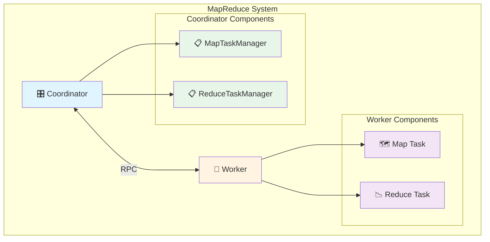

### 📋 核心组件职责

| 🎛️ 组件 | 📝 职责 | 🔧 主要方法 |
|----------|--------|------------|
| **Coordinator** | 任务调度、状态管理、RPC 服务 | `AssignTask`, `ReportMapTask`, `ReportReduceTask`, `Done` |
| **Worker** | 执行 Map/Reduce 任务、与 Coordinator 通信 | `Worker`, `mapTask`, `reduceTask` |
| **MapTaskManager** | 管理 Map 任务的生命周期 | `GetPendingTask`, `AssignTask`, `CompleteTask` |
| **ReduceTaskManager** | 管理 Reduce 任务的生命周期 | `GetPendingTask`, `AssignTask`, `CompleteTask`, `AddFile` |

---

## 🎯 核心组件

### 🎛️ Coordinator

**📌 核心职责**
- 🎯 任务调度和分配
- 📊 任务状态跟踪
- 👷 Worker 注册和管理
- 🌐 RPC 服务端

**🔄 主要工作流程**

1. **👷 Worker 注册**
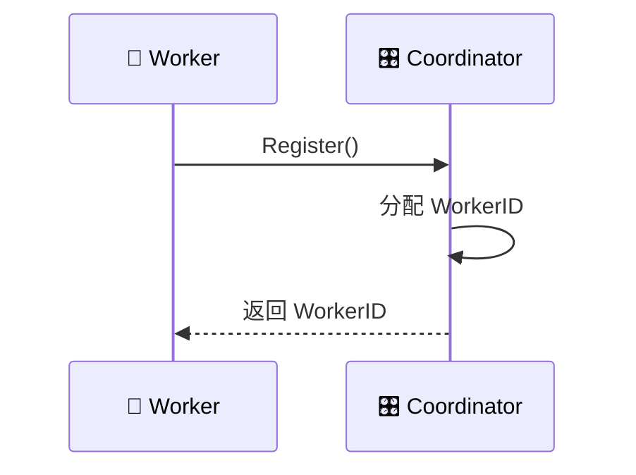

2. **📋 任务分配**
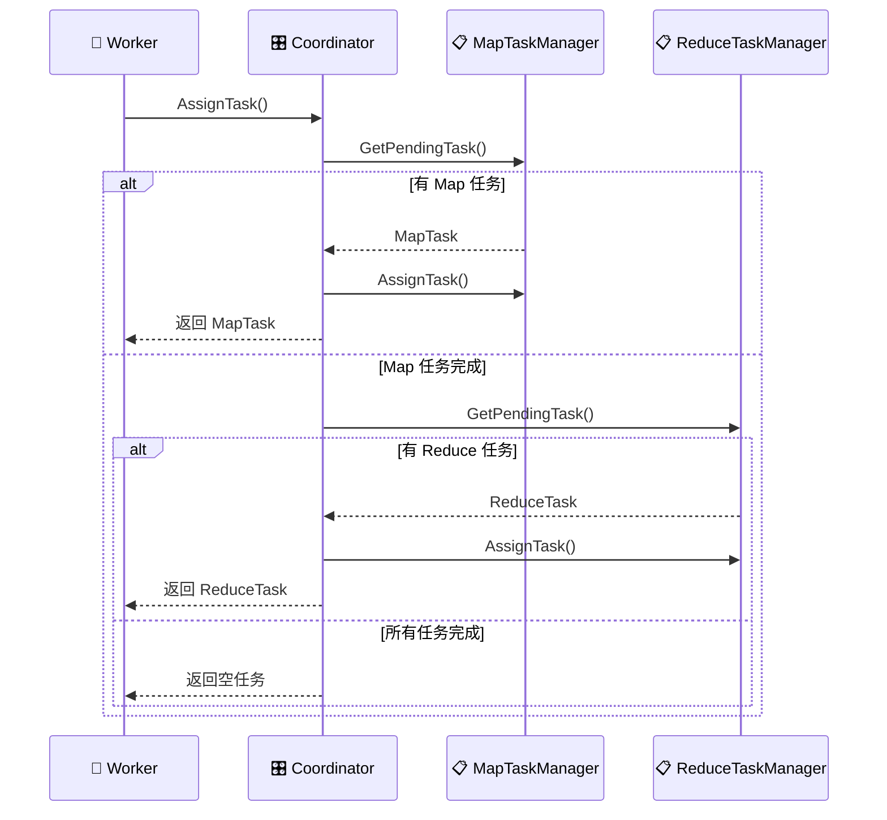

3. **✅ 任务报告**
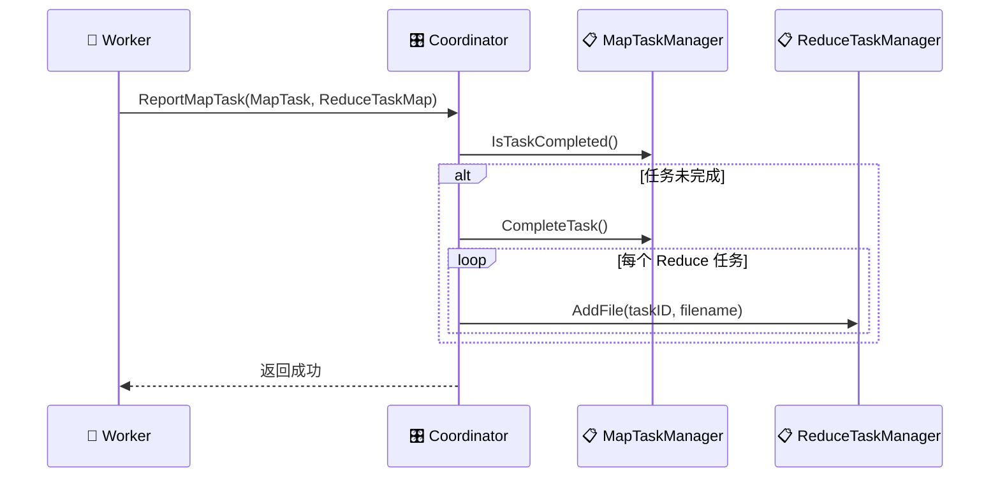

---

### 👷 Worker

**📌 核心职责**
- 🗺️ 执行 Map 任务
- 📉 执行 Reduce 任务
- 🌐 与 Coordinator 通信
- 🔄 处理任务失败和重试

**🔄 主要工作流程**

1. **🗺️ Map 任务执行**
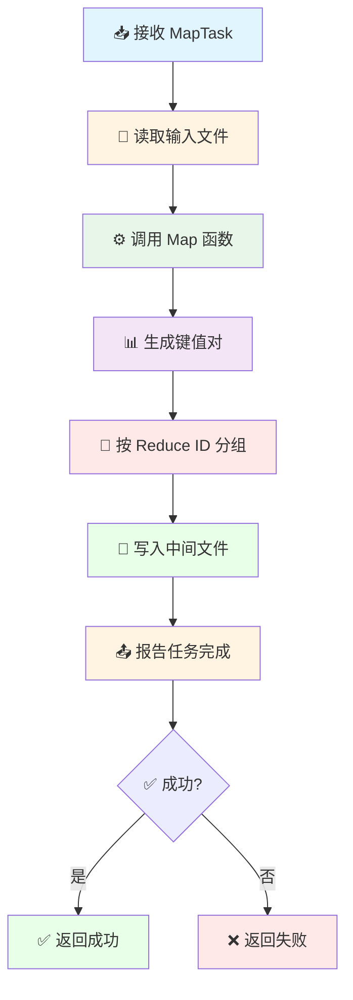

2. **📉 Reduce 任务执行**
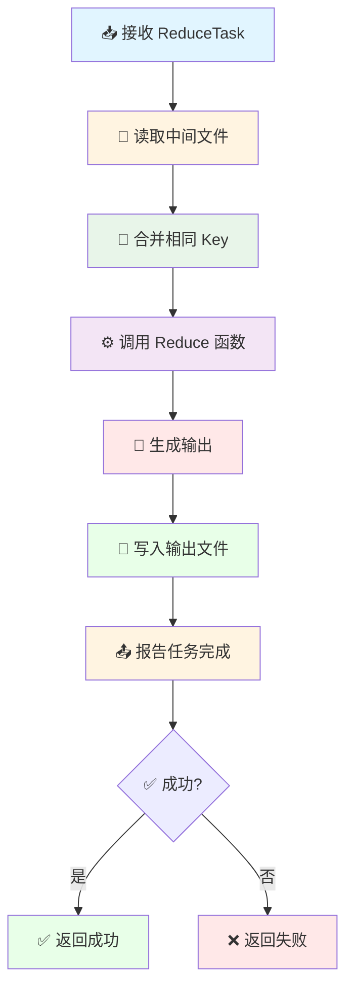

---

### 📋 MapTaskManager

**📌 核心职责**
- 🗺️ 管理 Map 任务的生命周期
- 📊 跟踪任务状态 (Pending/Assigned/Completed)
- ⏰ 处理任务超时和重新分配
- 📈 提供任务统计信息

**🔄 任务状态流转**
```
Pending → Assigned → Completed
    ↑         ↓
    └──── 超时重新分配 ────┘
```

**⏰ 超时机制**
- 任务分配后，如果 10 秒内未完成，视为超时
- 超时任务可以被重新分配给其他 Worker
- 防止 Worker 崩溃导致任务永久卡住

---

### 📋 ReduceTaskManager

**📌 核心职责**
- 📉 管理 Reduce 任务的生命周期
- 📊 跟踪任务状态
- 📁 管理中间文件
- ⏰ 处理任务超时和重新分配
- 📈 提供任务统计信息

**🔄 任务状态流转**
```
Pending → Assigned → Completed
    ↑         ↓
    └──── 超时重新分配 ────┘
```

---

## 🔄 完整链路图

### 🚀 系统启动流程

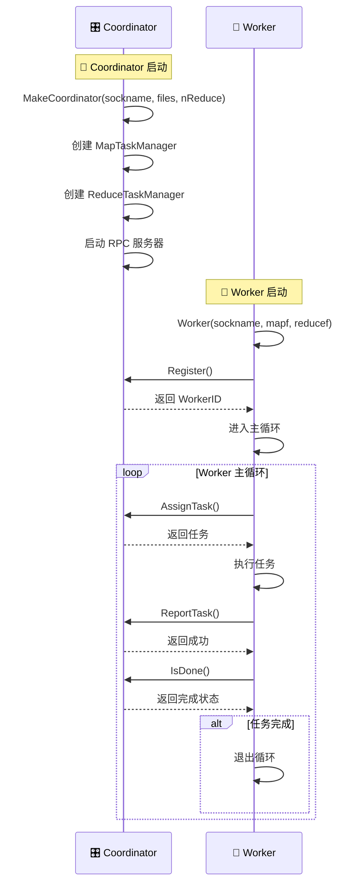

### 🗺️ Map 任务执行流程

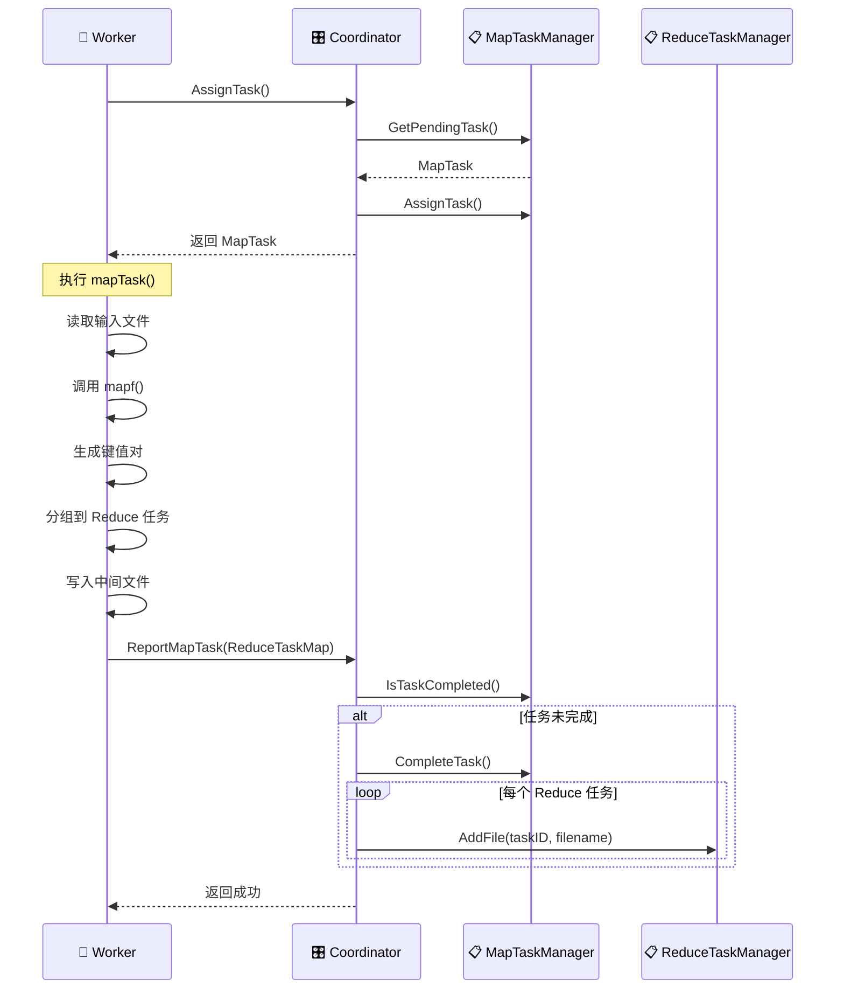

### 📉 Reduce 任务执行流程

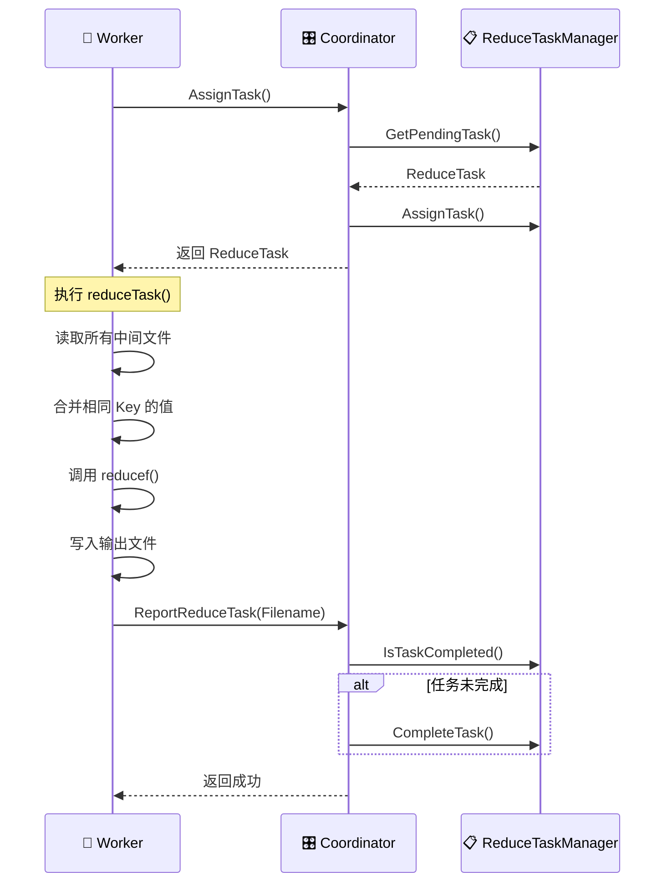

### ⏰ 任务超时和重新分配流程

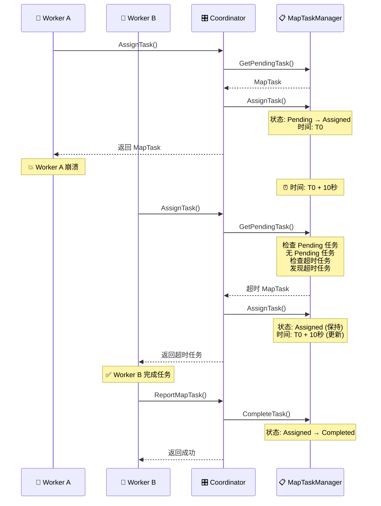

---

## 📊 数据流转过程

### 🔄 完整数据流示例

假设有 2 个输入文件和 3 个 Reduce 任务：

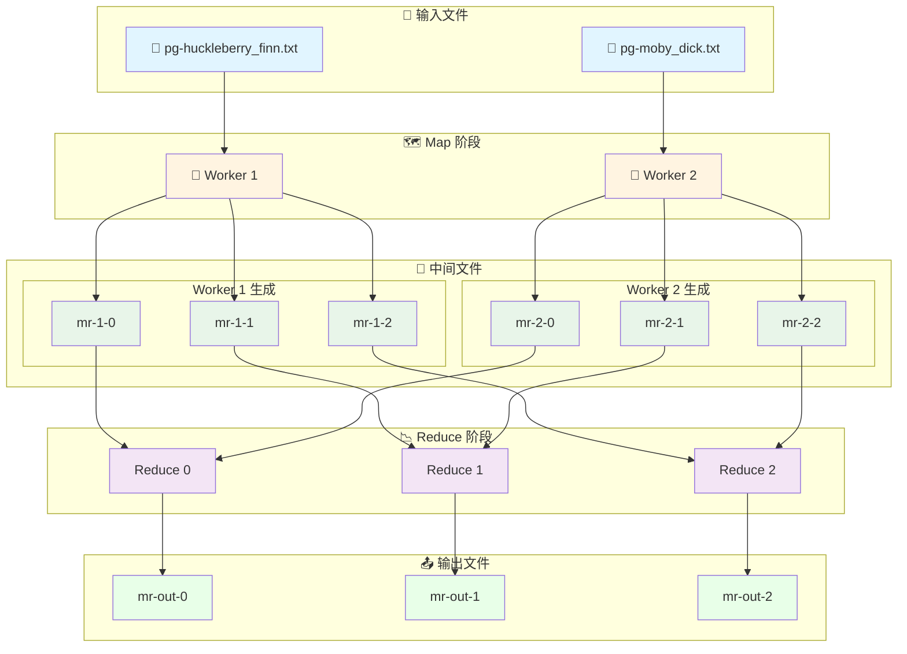

### 📊 数据处理流程

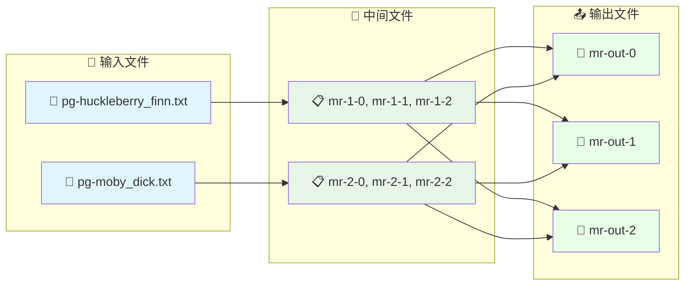

### ⏱️ 并发处理示例

```mermaid
gantt
    title MapReduce 并发处理时间线
    dateFormat  HH:mm:ss
    axisFormat  %H:%M:%S
    
    section 🎛️ Coordinator
    启动           :a1, 20:34:00, 1m
    
    section 👷 Worker 1
    启动           :b1, 20:34:01, 30s
    🗺️ Map 任务    :b2, after b1, 2m
    📉 Reduce 任务  :b3, after b2, 1m
    
    section 👷 Worker 2
    启动           :c1, 20:34:02, 30s
    🗺️ Map 任务    :c2, after c1, 2m
    📉 Reduce 任务  :c3, after c2, 1m
    
    section 👷 Worker 3
    启动           :d1, 20:34:03, 30s
    📉 Reduce 任务  :d2, after d1, 1m
```

---

## ⚙️ 关键特性

### ⏰ 任务超时机制
- 任务分配后，如果 10 秒内未完成，自动重新分配
- 防止 Worker 崩溃导致任务永久卡住
- 确保系统的高可用性

### 🔄 任务去重
- 通过任务状态跟踪，避免重复执行
- 已完成的任务会被标记，不会再次分配

### 🌐 RPC 重试机制
- Worker 与 Coordinator 的 RPC 调用支持重试
- 最多重试 3 次，每次间隔 100ms
- 提高系统的容错能力

### 🔒 并发安全
- 使用 `sync.RWMutex` 保护共享数据
- Coordinator 和 Task Manager 都有适当的锁机制
- 确保多 Worker 并发访问时的数据一致性

### 📝 结构化日志
- 使用 `logrus` 提供结构化日志
- 支持日志级别：DEBUG, INFO, WARN, ERROR
- 包含丰富的上下文信息（service, component, worker_id 等）

### 🎨 函数式编程
- 使用 `github.com/samber/lo` 库简化代码
- 提供丰富的函数式工具（Find, Filter, Map, Reduce 等）
- 提高代码的可读性和可维护性

---

## 🔧 故障处理

### 💥 Worker 崩溃处理
- 任务超时机制会自动检测崩溃的 Worker
- 超时任务会被重新分配给其他 Worker
- 系统继续正常运行，无需人工干预

### 🎛️ Coordinator 崩溃处理
- 当前实现中，Coordinator 是单点故障
- 崩溃后需要重启整个系统
- 未来可以考虑实现 Coordinator 的高可用

### 🌐 网络故障处理
- RPC 调用失败会自动重试
- 最多重试 3 次，每次间隔 100ms
- 如果重试失败，Worker 会退出

### 💾 磁盘故障处理
- 中间文件和输出文件存储在本地磁盘
- 磁盘故障会导致任务失败
- 建议使用可靠的存储系统

---

## 📝 总结

MapReduce 系统是一个分布式计算框架，通过以下核心功能实现大规模数据处理：

- 🎯 **任务调度**: Coordinator 负责任务的分配和调度
- 🗺️ **Map 阶段**: Worker 并行处理输入文件，生成中间结果
- 📉 **Reduce 阶段**: Worker 合并中间结果，生成最终输出
- ⏰ **容错机制**: 任务超时、RPC 重试确保系统高可用
- 🔒 **并发安全**: 使用锁机制保护共享数据

系统采用现代化的编程实践，包括结构化日志、函数式编程等，确保代码的可读性和可维护性。